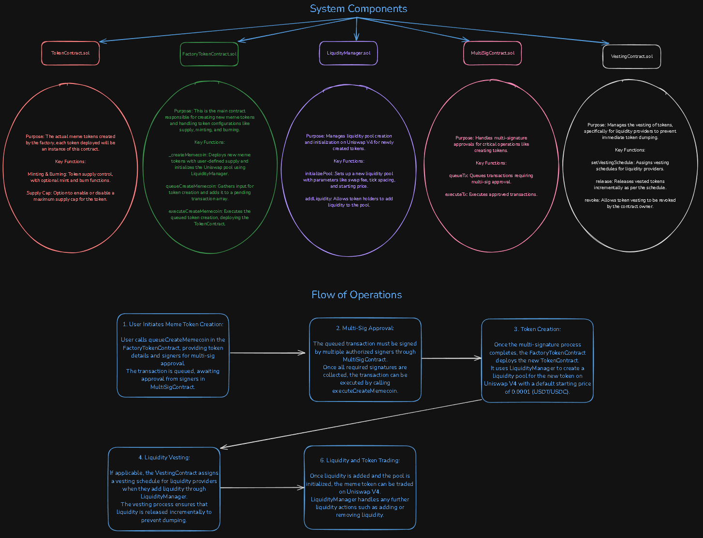

# CraftMeme 🚀

Welcome to MemeCoin Launchpad, a decentralized platform where users can create and launch their own ERC-20 memecoins, provide liquidity via Uniswap, and enjoy safe, controlled token vesting to minimize potential bad actors in the space. This project was built for the QuickNode Hackathon and uses QuickNode Functions to streamline operations and ensure smooth user experience.

- [CraftMeme 🚀](#craftmeme-)
  - [Overview](#overview)
  - [Deployed Contracts](#deployed-contracts)
  - [Project Architecture](#project-architecture)
  - [Core Features](#core-features)
    - [ERC-20 Factory](#erc-20-factory)
    - [Uniswap Liquidity Integration](#uniswap-liquidity-integration)
    - [Liquidity Thresholds](#liquidity-thresholds)
    - [Token Vesting](#token-vesting)
    - [Multisignature Governance](#multisignature-governance)
      - [Security Features](#security-features)
  - [Technology Stack](#technology-stack)
  - [Usage of QuickNode Functions](#usage-of-quicknode-functions)
  - [Usage of QuickNode Streams](#usage-of-quicknode-streams)
  - [Marketplace Addons](#marketplace-addons)
  - [Smart Contracts](#smart-contracts)
    - [Factory Contract](#factory-contract)
    - [Vesting Contract](#vesting-contract)
    - [Multisig Contract](#multisig-contract)
  - [Potential Future Enhancements](#potential-future-enhancements)
  - [License](#license)

## Overview

MemeCoin Launchpad is designed to be a simple, secure, and user-friendly platform where users can create and launch ERC-20 meme tokens, provide liquidity via Uniswap, and ensure fair distribution using a vesting mechanism. Our goal is to build a reliable launchpad for meme tokens that not only enables users to create and trade tokens but also prevents bad actors from executing rugpulls or scams.

This platform integrates with QuickNode Functions, Uniswap, and OpenZeppelin libraries to provide a seamless token creation and liquidity experience.

## Deployed Contracts on Base Sepolia

- MultiSigContract : https://base-sepolia.blockscout.com/address/0xc3D976e1d4B8B4bf8361bAED9928E5df546d18c3?tab=write_contract
- VestingContract : https://base-sepolia.blockscout.com/address/0x13caa03C683825c31C3429c8ecD58c15D6FbD2f1?tab=contract
- LiquidityManager : https://base-sepolia.blockscout.com/address/0x432891844dD3215844B47827d5A6581c4Cb72378?tab=contract
- FactoryTokenContract : https://base-sepolia.blockscout.com/address/0xd47BDd29C984722B229141dE99C80c210de04E02?tab=read_contract

## Deployed Contracts on ETH Sepolia

- MultiSigContract : https://eth-sepolia.blockscout.com/address/0xa9313f26c6493a9D10F2bF8E7Ba5da6210D7D012
- VestingContract : https://eth-sepolia.blockscout.com/address/0x8c560AE44b89A7bE962486fd1d4316B688baF8C2
- LiquidityManager : https://eth-sepolia.blockscout.com/address/0xD9C0269b0d6a8200f10c2A9A0A85bA400761befD
- FactoryTokenContract : https://eth-sepolia.blockscout.com/address/0xa2a60468c228c363dB665d0016B6E5002efb835A

## Project Architecture

The project consists of the following main components:

1. ERC-20 Token Factory: A smart contract factory for users to create their own meme tokens.
2. Liquidity Integration with Uniswap: Allows token creators to provide initial liquidity and facilitate trades on Uniswap.
3. Vesting Contracts: To ensure that liquidity providers receive their tokens gradually over a set period to prevent rugpulls.
4. Multisignature Contract Ownership: Enhanced security for token creators by requiring multiple signers to approve changes to the token contract.

## Core Features

### ERC-20 Factory

The MemeCoin Launchpad allows users to create their own meme tokens through an ERC-20 token factory. The factory contract uses the OpenZeppelin ERC-20 library for reliable and secure token implementation.

- Parameters:
  - Token Name
  - Token Symbol
  - initial Supply
  - Token Owner
  - Additional parameters like minting, burning, and custom fee mechanisms can be added if needed.

### Uniswap Liquidity Integration

Once a meme token is created, the token creator can choose to provide liquidity through Uniswap. This feature allows the token to be traded on the decentralized exchange, creating a marketplace for buying and selling meme tokens.

- Initial Liquidity: Users can provide a minimum amount of testnet USDC/USDT tokens (e.g., 20 USDC/USDT) to meet the liquidity threshold.
- If the liquidity threshold is not met, the token will not be tradeable on Uniswap until the threshold is achieved.

### Liquidity Thresholds

To ensure that meme tokens are liquid enough to be traded fairly, the platform requires a minimum liquidity threshold (e.g., 20 USDC/USDT). Once this threshold is met, the tokens become eligible for trade on Uniswap.

### Token Vesting

To prevent sudden dumps and rugpulls, MemeCoin Launchpad implements a vesting schedule for tokens purchased during the initial liquidity provision. The purchased tokens are locked and gradually released over a 10-month period. This helps maintain price stability and encourages long-term holding.

- Vesting Breakdown:
  - Month 1: 8% of the purchased tokens released
  - Gradual increase each month, with full release by Month 10.

### Multisignature Governance

For added security, meme tokens created on the platform will have multisignature governance. This ensures that no single individual can make malicious changes or drain the contract. Multiple signers must approve actions related to the contract, such as minting or changing ownership.

#### Security Features

- Rugpull Protection: Vesting contracts ensure that liquidity providers receive their tokens over time, preventing sudden mass sell-offs.
- Multisig Ownership: Requires multiple signers for sensitive actions, preventing a single point of failure.
- OpenZeppelin Libraries: The token contracts utilize well-audited OpenZeppelin libraries to ensure security and compliance with ERC-20 standards.

## Technology Stack

- Smart Contracts: Solidity, OpenZeppelin ERC-20
- Uniswap V3: Liquidity pool creation and token swapping
- QuickNode Functions: For off-chain operations and API calls
- QuickNode Streams: For real-time data related to token liquidity and trades
- Frontend: Next.js, Wagmi for interacting with smart contracts
- Testnets: Ethereum Sepolia, Base Sepolia for development and testing

## Usage of QuickNode Functions

We utilize QuickNode Functions to offload several key backend operations, including:

- Creating API tools for real-time liquidity data and Uniswap price feeds.
- Automating off-chain processes like token distribution schedules and vesting mechanics.
- Reducing the workload on smart contracts by running heavy computations off-chain.

## Usage of QuickNode Streams

We leverage QuickNode Streams to gather real-time liquidity data and trade information from Uniswap. Our platform uses these streams to:

- Provide users with updates on token liquidity and price movements.
- Alert users when a memetoken reaches its liquidity threshold.
- Automatically trigger the unlocking of vested tokens based on time schedules.

## Marketplace Addons

We integrated QuickNode Marketplace addons to enhance the functionality and security of our platform, including:

- QuickNode Analytics for tracking token metrics.
- QuickNode Alerts for sending real-time notifications when tokens reach key milestones, such as liquidity thresholds or vesting completions.

## Smart Contracts

### Factory Contract

The ERC-20 Factory allows users to create meme tokens on demand.

- Functions:
  - createToken(name, symbol, initialSupply, owner)
  - provideLiquidity(tokenAddress, amount)

### Vesting Contract

Handles the gradual release of tokens to prevent sudden sell-offs.

- Functions:
  - lockTokens(user, amount, duration)
  - releaseTokens(user)

### Multisig Contract

Provides security for memetoken owners by requiring multiple approvals for sensitive actions.

- Functions:
  - addSigner(address)
  - removeSigner(address)
  - approveTransaction()

## Potential Future Enhancements

- Staking: Introduce staking pools where memecoin holders can earn rewards for holding their tokens.
- Cross-chain Support: Expand to other blockchains (e.g., Polygon, BSC) to widen the reach of meme tokens.
- Governance: Allow memetoken holders to vote on project-related decisions using a decentralized governance model.

## License

MIT License
